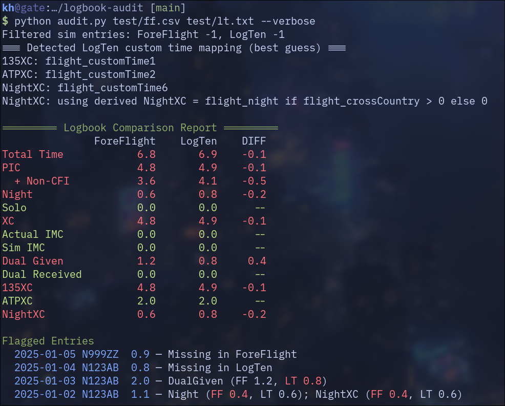

# logbook-audit

Compare ForeFlight and LogTen logbook exports and flag discrepancies.

> [!CAUTION]
> This was invented by an LLM when I asked for a simple logbook file comparison. I have tried to massage the script to be more generically useful, but it is tailored to my use case and I can't guarantee your outcome.

## Getting the data

### ForeFlight

1. Login to ForeFlight on a web browser.
2. From the **Logbook** tab, go to **Export** and obtain a local copy of the file.

### LogTen

1. From the **Logbook** tab, go to **Reports → Exporters → Export Flights (Tab)**.
2. **Configure Report**, confirm "All" selected, and **Generate**. Use the dialogue to obtain this file in whatever way you choose.

> [!NOTE]
> You don't need to rename or move the files. The script looks for the most recent ForeFlight
> (`logbook_YYYY-MM-DD_HH_MM_SS.csv`) and LogTen (`Export Flights (Tab) - ...txt`) exports in
> `~/Downloads` (or `~/downloads`), and reads them in place. Use `--dir <folder>` to point at a
> different location, or pass the two file paths as arguments to override discovery entirely.

## Usage

Run from the repo root:

```
python audit.py
```

That's it. The self-test is `python audit.py test`. If you run the test files manually, you will see:


## Options

You shouldn't need to use these, and I mostly took advantage of them while testing.

| Flag | Effect |
|------|--------|
| `--dir FOLDER` | Search this folder for the most recent exports instead of `~/Downloads` |
| `--tol N` | Tolerance in hours before a difference is flagged (default: 0.05) |
| `--custom-night-xc` | Use a dedicated custom column for Night XC in LogTen instead of deriving it |
| `--include-sim` | Include simulator/FTS entries in the comparison |
| `--verbose` | Show extra debug info (custom column mapping, sim filter counts) |
